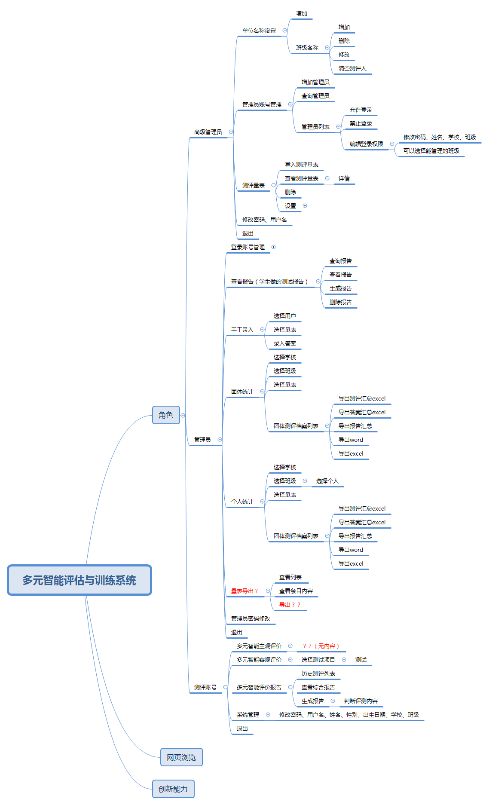
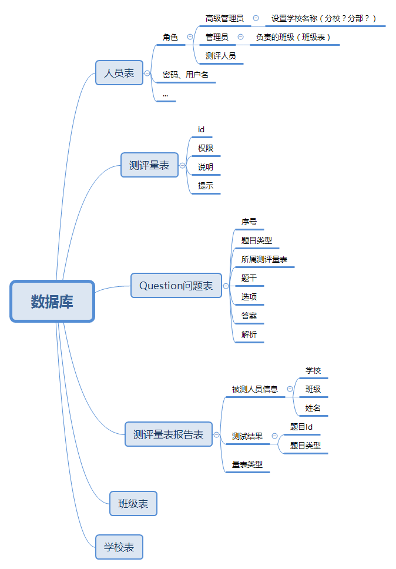

# es examination system

## 模块

#### 表格

|言语语言智能|数理逻辑智能|人际交往智能|视觉空间智能|
|:---|:---:|:---:|---:|
|音乐节奏智能|自我意识智能|身体运动智能|自然观察智能|
|创新能力|多元智能测评|             |         |

### 更新日志
_2020-1-19 22:45:23_
+ 大体完成，剩余细节部分：
    + 管理员的个人统计部分
    + 播放音频
    + 多元智能单独量表报告
    + 各个角色修改信息
    + 添加测评人的批量
    + 表格的批量操作
+ 网页整理：
    + 二姐页面
+ 创新训练
    + 添加二级导航中间页

_2019年12月5日21:56:12_

+ 本地html显示本地图片验证通过
+ 开机启动app

_2019-12-9 22:09:59_
+ 数据库思维导图，很多尚未明确
+ 数据库Room框架实现User表的管理

### 项目功能思维导图

+ 整体功能
    + 

+ 数据库
    + 

